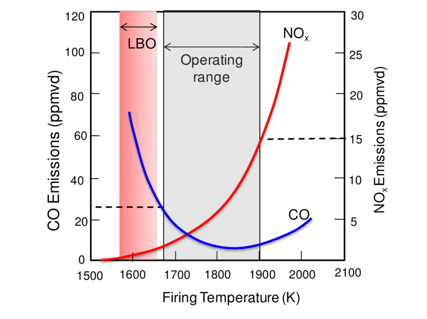

# GTE emissions

Prediction emissions CO and NOx from gas-turbine engine performance.

## About
1. Collection of physical data from sensors on different engines in different operating modes.
1. Data engineering (preprocessing, outliers detection, etc)
1. Reverse engineering design data.
1. Finding the best ML regression algorithm.
1. Hyperparameter selection
1. Prediction new data.